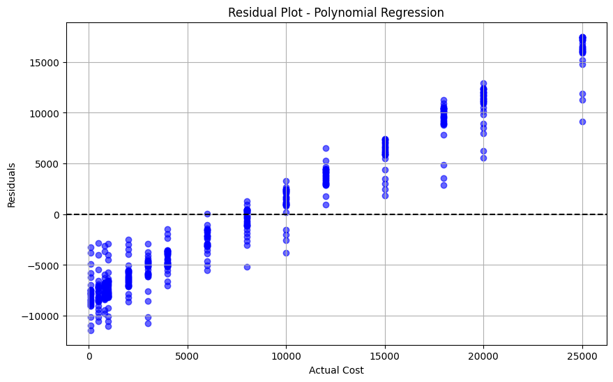

# 🏥 Hospital Cost Prediction using Machine Learning

This project utilizes machine learning techniques and statistical analysis to predict hospital costs based on various patient-related and hospital-specific features. It demonstrates the use of regression models, data preprocessing, and visualization techniques for predictive modeling.

---

## 📌 **Project Goals**
- Predict hospital costs using patient information.
- Explore relationships between **Age**, **Length of Stay**, **Satisfaction**, and **Cost**.
- Compare regression models for performance.
- Visualize insights from the dataset.

---

## 📂 **Dataset Description**
The dataset contains patient information with the following features:
- **Age:** Age of the patient.
- **Length_of_Stay:** Duration of stay in the hospital (in days).
- **Satisfaction:** Patient satisfaction rating (scale).
- **Cost:** Hospital cost for the patient (target variable).

---

## 🛠️ **Libraries Used**
- **NumPy**
- **Pandas**
- **Matplotlib**
- **Seaborn**
- **Scikit-learn**

---

## 🔄 **Model Pipeline**
1. **Data Loading & Exploration:** Read the CSV dataset and check for missing values.
2. **Descriptive Statistics:** Calculate Mean, Median, Mode, Variance, Standard Deviation, and Percentiles of hospital costs.
3. **Data Visualization:**
   - Histogram of hospital costs.
   - Correlation heatmap to observe feature relationships.
4. **Regression Models:**
   - **Simple Linear Regression:** Predicting Cost based on Length of Stay.
   - **Polynomial Regression (Degree 3):** Capturing non-linear patterns between Length of Stay and Cost.
   - **Multiple Linear Regression:** Using Age, Length of Stay, and Satisfaction together to predict Cost.
5. **Feature Scaling:** Standardize the Length of Stay feature.
6. **Model Evaluation:** Evaluate models using **R² Score**, **MAE**, **MSE**, and **RMSE**.
7. **Residual Analysis:** Visualize model residuals to check for errors and biases.

---

## 📊 **Visualizations**
### Histogram of Hospital Costs


### Correlation Heatmap


### Regression Models
#### Linear Regression (Length of Stay vs Cost)


#### Polynomial Regression (Degree 3)


### Residual Plots
#### Linear Regression Residuals


#### Polynomial Regression Residuals


#### Multiple Regression Residuals


---

## 📈 **Results Table (Model Comparison)**
| Model                                     | R² Score | MAE     | RMSE    |
| ----------------------------------------- | -------- | ------- | ------- |
| Simple Linear Regression (Length of Stay) | 0.013    | 6545.85 | 7617.57 |
| Polynomial Regression (Degree 3)          | 0.032    | 6430.64 | 7547.53 |
| Multiple Linear Regression                | 0.235    | 5514.30 | 6709.28 |

---

## 💼 **Author**
**Anthony Sergo**

- GitHub: https://github.com/Tony-Magabush28
- LinkedIn: www.linkedin.com/in/anthony-sergo1 
- Email: anthonysergo9@gmail.com
- Portfolio: https://my-flask-portfolio.onrender.com/


🔗 [Connect with me on LinkedIn](https://www.linkedin.com/in/anthony-sergo1)  
💬 Feel free to explore, star ⭐, or fork 🍴 this repository!

---

## 🚀 **How to Run This Project**
```bash
1. Clone this repo
2. Install dependencies: pip install -r requirements.txt
3. Run the notebook or script
# Hospital-Cost-Prediction
